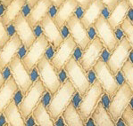
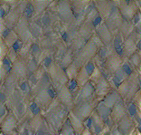
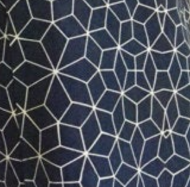
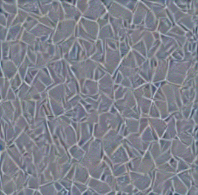

# Style Extraction


## What is style?

Style can be defined as the correlation of different features, it is the coexistence of certain basic features (different edges, colors) in the same area of an image, and the repetition of such coexistence across the image, collectively deciding the pattern of an image. 


## How to quantify style?

 To quantify style, we could use the following algorithm:

1. Take a image as input, denoted as $I$, feed it into a pre-trained CNN model (eg. VGG19)

2. Extract the feature matrix at certain convolutional layers (conv1_1, conv2_1, conv3_1, conv4_1, conv5_1 of VGG19).
3. Flatten each feature matrix $(d, w, h)$ to $(d, wh)$, denote as $M_i$. Calculate gram matrices, $G_i = M_i * M_i^T$. $G$ represents the style of an image.

To visualize the style, we could use the following algorithm:

1. Generate a random image with the same size of $I$, denoted as $I'$.

2. Process $I'$ with steps described above, generate the corresponding gram matrices $G'$
3. Optimize $I'$, with the loss defined as $L = \mid G - G'\mid$


## Usage

```
python style_extraction.py
```


## Results

| Input Image                                      | Product Style                                        |
| ------------------------------------------------ | ---------------------------------------------------- |
|  |  |
|  |  |

